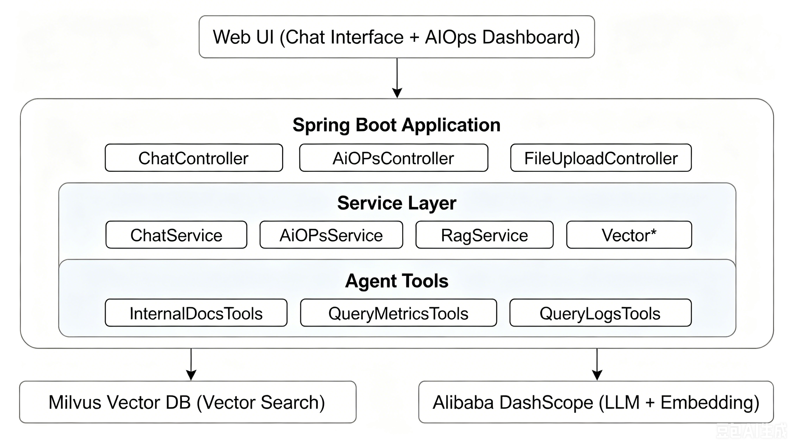

# 小话痨值班员

[](https://www.oracle.com/java/)
[](https://spring.io/projects/spring-boot)
[](LICENSE)
[](CONTRIBUTING.md)

基于 Spring Boot + Spring AI 的智能运维代理系统，集成 Milvus 向量数据库和阿里云 DashScope 大语言模型。

## 📺 项目演示

[点击观看演示视频](https://v.douyin.com/VlqVj0QuJ0s/)

## 📖 项目简介

小话痨值班员提供两大核心能力：

| 核心能力 | 说明 |
|---------|------|
| 🔍 **RAG 智能问答** | 基于检索增强生成的智能问答，支持多轮对话、流式输出 |
| ⚡ **AIOps 智能运维** | 基于 Planner-Executor-Replanner 架构的自动化运维，支持告警分析、日志查询、智能诊断 |

## ✨ 核心特性

| 特性 | 说明 |
|------|------|
| 🤖 **RAG 问答** | 向量检索 + 多轮对话 + 流式输出，精准检索内部文档 |
| 🚀 **AIOps 运维** | 智能诊断 + 多 Agent 协作 + 自动报告生成 |
| 🔧 **工具集成** | 文档检索、告警查询、日志分析、时间工具 |
| 💬 **会话管理** | 上下文维护、历史管理、自动清理 |
| 🌐 **Web 界面** | 响应式界面 + RESTful API，即开即用 |

## 🏗️ 系统架构



## 🛠️ 技术栈

| 分类 | 技术 | 版本 | 说明 |
|------|------|------|------|
| **基础框架** | Java | 17+ | 开发语言 |
| | Spring Boot | 3.2.0 | 应用框架 |
| **AI 能力** | Spring AI | 1.1.0 | AI Agent 框架 |
| | Spring AI Alibaba | 1.1.0.0-RC2 | 阿里云 AI 集成 |
| | DashScope SDK | 2.17.0 | 阿里云 AI 服务 |
| **数据存储** | Milvus | 2.6.10 | 向量数据库 |
| **前端** | HTML/CSS/JS | - | 原生前端 |

## 📦 项目结构

```
SreAgent/
├── pom.xml                          # Maven 依赖配置
├── Makefile                         # 自动化构建脚本
├── vector-database.yml              # Milvus 向量数据库配置
├── aiops-docs/                      # 运维知识库文档
│
├── src/main/java/org/example/
│   ├── Main.java                    # 应用入口
│   ├── controller/                  # 控制器层
│   ├── service/                     # 业务逻辑层
│   ├── agent/tool/                  # Agent 工具集
│   ├── config/                      # 配置类
│   └── dto/                         # 数据传输对象
│
└── src/main/resources/
    ├── application.yml              # 应用配置
    ├── application.yml.example      # 配置模板
    ├── logback.xml                  # 日志配置
    └── static/                      # 静态资源
```

## 🚀 快速开始

### 环境要求

- Java 17+
- Maven 3.9+
- Docker & Docker Compose
- 阿里云 DashScope API Key

### 1. 克隆项目

```bash
git clone https://github.com/wanglihong564/SreAgent.git
cd SreAgent
```

### 2. 配置环境变量

```bash
# Linux/macOS
export DASHSCOPE_API_KEY=your-api-key

# Windows PowerShell
$env:DASHSCOPE_API_KEY="your-api-key"

# Windows CMD
set DASHSCOPE_API_KEY=your-api-key
```

或者复制配置模板并修改：

```bash
cp src/main/resources/application.yml.example src/main/resources/application.yml
# 编辑 application.yml，填入你的 API Key
```

### 3. 一键启动（推荐）

```bash
make init
```

这将自动完成：
- ✅ 启动 Milvus 向量数据库
- ✅ 构建并启动 Spring Boot 应用
- ✅ 上传运维文档到向量库

### 4. 手动启动

```bash
# 启动向量数据库
docker compose up -d -f vector-database.yml

# 启动服务
mvn clean install
mvn spring-boot:run
```

### 5. 访问应用

- **Web 界面**: http://localhost:9900
- **Milvus Attu**: http://localhost:8000

## 📡 API 接口

### 1. 智能问答

**流式对话（推荐）**
```bash
POST /api/chat_stream
Content-Type: application/json

{
  "Id": "session-123",
  "Question": "如何处理 CPU 使用率过高的问题？"
}
```

**普通对话**
```bash
POST /api/chat
Content-Type: application/json

{
  "Id": "session-123",
  "Question": "如何处理内存泄漏？"
}
```

### 2. AIOps 智能运维

```bash
POST /api/ai_ops
Content-Type: application/json

{
  "alertId": "alert-001",
  "description": "服务器 CPU 使用率超过 90%"
}
```

### 3. 文档管理

```bash
# 上传文档
POST /api/upload
Content-Type: multipart/form-data

file: @document.md

# 健康检查
GET /milvus/health
```

## 💡 使用示例

### Web 界面

访问 http://localhost:9900 即可使用：

1. **智能问答** - 输入问题，获取基于知识库的准确答案
2. **AIOps 分析** - 点击侧边栏按钮，自动分析告警并生成处理建议
3. **文档上传** - 上传运维文档，丰富知识库

### 命令行示例

```bash
# 智能问答
curl -X POST http://localhost:9900/api/chat \
  -H "Content-Type: application/json" \
  -d '{"Id":"test","Question":"什么是熔断机制？"}'

# 健康检查
curl http://localhost:9900/milvus/health
```

## ⚙️ 配置说明

### 主要配置项

| 配置项 | 默认值 | 说明 |
|--------|--------|------|
| `server.port` | 9900 | 服务端口 |
| `milvus.host` | localhost | Milvus 地址 |
| `milvus.port` | 19530 | Milvus 端口 |
| `rag.model` | qwen3-max | LLM 模型 |
| `rag.top-k` | 3 | 检索数量 |
| `document.chunk.max-size` | 800 | 分片大小 |

### 环境变量

| 变量名 | 说明 |
|--------|------|
| `DASHSCOPE_API_KEY` | 阿里云 DashScope API Key（必需） |
| `MILVUS_HOST` | Milvus 服务器地址 |
| `MILVUS_PORT` | Milvus 服务器端口 |
| `MILVUS_USERNAME` | Milvus 用户名 |
| `MILVUS_PASSWORD` | Milvus 密码 |
| `PROMETHEUS_URL` | Prometheus 服务地址 |

### 工具调用配置

系统内置以下工具，可被 AI Agent 自动调用：

| 工具 | 功能 | 模式 |
|------|------|------|
| `query_internal_docs` | 检索内部文档 | Mock/生产 |
| `query_metrics` | 查询监控指标 | Mock/生产 |
| `query_logs` | 查询日志数据 | Mock/生产 |
| `get_current_time` | 获取当前时间 | - |

## 🤝 贡献

我们欢迎任何形式的贡献！请查看 [贡献指南](CONTRIBUTING.md) 了解详情。

## 📄 许可证

本项目基于 [MIT License](LICENSE) 开源。

## 🙏 致谢

- [Spring AI](https://spring.io/projects/spring-ai) - AI 应用开发框架
- [Milvus](https://milvus.io/) - 开源向量数据库
- [阿里云 DashScope](https://dashscope.console.aliyun.com/) - 大语言模型服务

---

如果这个项目对你有帮助，欢迎 ⭐ Star 支持！
